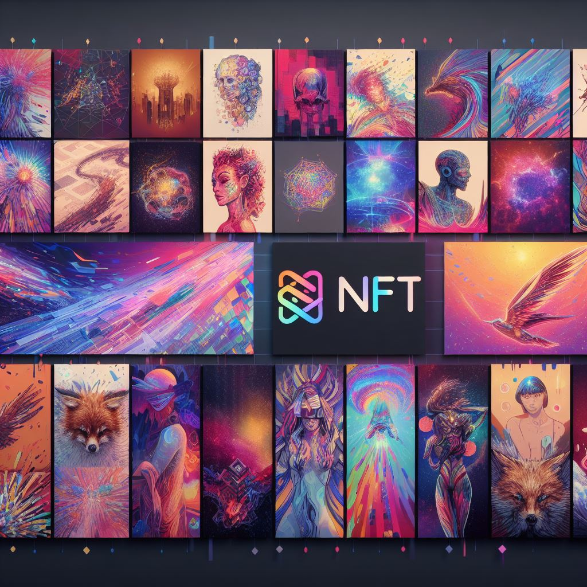

<div align="center">


 <h1>Starsheep Marketplace</h1>
</div>

Code Crafters: Miguel A. Cuevas G. & Milka Y. Trinidad G.

Esta pagina web fue creada con SvelteKit. Creedenciales para probar aplicación:

- Usuario: test
- Contraseña: 12345678

[GitHub Repo](https://github.com/secretarybird97/starsheep-pb)

## Correr utilizando Docker (recomendado)

La mejor forma de correr la aplicación es utilizando docker, ya que todo se mantiene dentro de un contenedor y no se cambia la información del sistema operativo host. Para más información, visite el sitio web de [Docker](https://docs.docker.com/get-started/).

### Iniciar aplicación

```bash
cd docker
docker compose up -d
```

La pagina web se encontrará en [localhost:3000](http://localhost:3000).

### Detener

```bash
docker compose down
```

### Eliminar archivos

```bash
docker compose down -v --rmi all --remove-orphans
```

## Correr localmente

Para poder poder correrla de manera nativa, se necesita tener instalado Node.js y pnpm.

### Instalar dependencias

En caso de no tener instalado Node.js, se puede instalar desde [aquí](https://nodejs.org/en/download/).

Instalar pnpm

```bash
npm install -g pnpm
```

Instalar las dependencias del proyecto

```bash
pnpm install --prod --frozen-lockfile
```

Construir aplicación

```bash
pnpm build
```

Inicializar base de datos

```bash
cd docker
docker compose up db
```

En una nueva terminal, iniciar aplicación

```bash
pnpm preview
```

## Dev Container

Este repositorio incluye un contenedor de desarrollo de Visual Studio Code Dev Containers/GitHub Codespaces.

- Para [Dev Containers](https://aka.ms/vscode-remote/download/containers), utilice el comando **Dev Containers: Clone Repository in Container Volume...** que crea un volumen Docker para mejorar la E/S del disco en macOS y Windows.

  - Si ya tiene VS Code y Docker instalados, también puede hacer clic [aquí](https://vscode.dev/redirect?url=vscode://ms-vscode-remote.remote-containers/cloneInVolume?url=https://github.com/microsoft/vscode) para comenzar. Esto hará que VS Code instale automáticamente la extensión Dev Containers si es necesario, clone el código fuente en un volumen de contenedor y active un contenedor de desarrollo para su uso.

- Para Codespaces, instale la extensión [GitHub Codespaces](https://marketplace.visualstudio.com/items?itemName=GitHub.codespaces) en VS Code y use el comando **Codespaces: Create new Codespace**.

Revisar [CONTRIBUTING.md](CONTRIBUTING.md) para más información.

## Licencia

Copyright (c) 2023 Code Crafters. Todos los derechos reservados.

Licensiado bajo la licencia [MIT](LICENSE).
